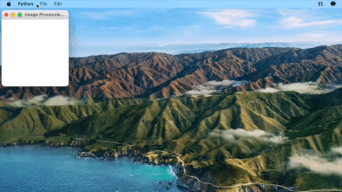
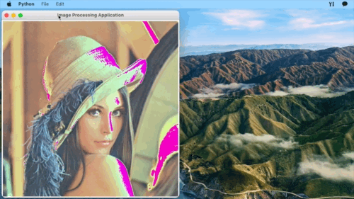
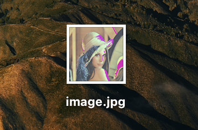
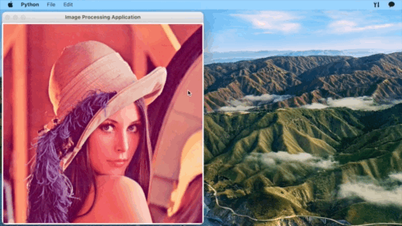
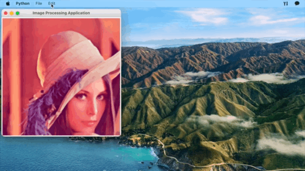
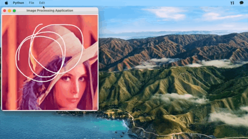

# Simple Image Processing Application

`python` `tkinter` `PIL` `OpenCV`

## Menubar

- File
  - Open
  - Save As...
- Edit
  - Crop
  - Filter
  - Draw
  - Adjust(RGB)
  - Clear

---

## __File__

## Open Image

1. Select File > Open
2. Choose an image file to open

## Save As...

1. Select File > Save As...
2. Enter the filename & directory
3. Click Save

---
## __Edit__

## Crop

1. Give row & column to index-slice the image
2. The original size is shown on the top of the 'Crop' window
3. Click 'OK' to see the result
4. Click 'Apply' or 'Cancel'

## Filter

1. Choose what filter to apply
2. Negative / Black White / Sepia / Emboss / Gaussian Blur / Median Blur
3. Click 'Apply' or 'Cancel'

## Draw

1. Draw by click & dragging with your mouse on the image
2. Click 'Apply' or 'Cancel'

## Adjust

1. Control the sliders to adjust RGB value
2. The slider range is (-100, 100)
3. Click 'OK' to see the result
4. Click 'Apply' or 'Cancel'

## Clear

1. If you want to go back to the original image, click Edit > Clear