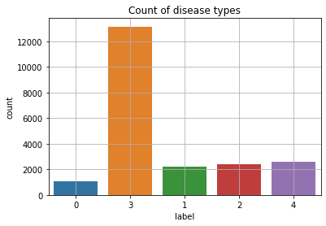
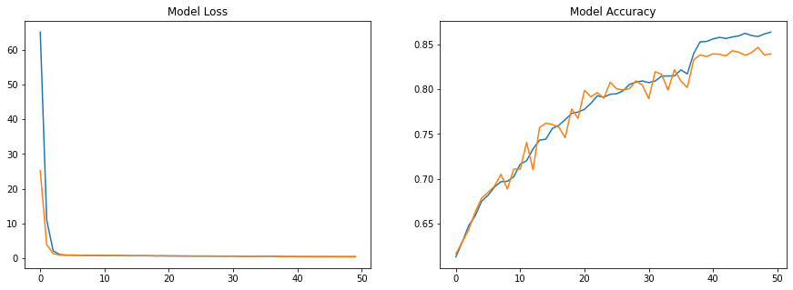

# Cassava Leaf Disease Classification

## VGG16
---
|Layer (type)|Output Shape|Param #|  
|---|---|---|
|input_1 (InputLayer)|[(None, 224, 224, 3)]|0|
|block0_conv0 (Conv2D)|(None, 224, 224, 64)|1792|
|block0_conv1 (Conv2D)|(None, 224, 224, 64)|36928|
|block0_pooling (MaxPooling2D)|(None, 112, 112, 64)|0| 
|block1_conv0 (Conv2D)|(None, 112, 112, 128)|73856|     
|block1_conv1 (Conv2D)|(None, 112, 112, 128)|147584| 
|block1_pooling (MaxPooling2D (None, 56, 56, 128)|0|
|block2_conv0 (Conv2D)|(None, 56, 56, 256)|295168|
|block2_conv1 (Conv2D)|(None, 56, 56, 256)|590080|
|block2_conv2 (Conv2D)|(None, 56, 56, 256)|590080|
|block2_pooling (MaxPooling2D)|(None, 28, 28, 256)|0|
|block3_conv0 (Conv2D)|(None, 28, 28, 512)|1180160|
|block3_conv1 (Conv2D)|(None, 28, 28, 512)|2359808|
|block3_conv2 (Conv2D)|(None, 28, 28, 512)|2359808|
|block3_pooling (MaxPooling2D)|(None, 14, 14, 512)|0|
|block4_conv0 (Conv2D)|(None, 14, 14, 512)|2359808|
|block4_conv1 (Conv2D)|(None, 14, 14, 512)|2359808|
|block4_conv2 (Conv2D)|(None, 14, 14, 512)|2359808|
|block4_pooling (MaxPooling2D)|(None, 7, 7, 512)|0|
|flatten (Flatten)|(None, 25088)|0|
|fc1 (Dense)|(None, 4096)|102764544|
|dropout (Dropout)|(None, 4096)|0| 
|fc2 (Dense)|(None, 4096)|16781312| 
|dropout_1 (Dropout)|(None, 4096)|0|
|predictions (Dense)|(None, 5)|20485|

+ Total params: 134,281,029
+ Trainable params: 134,281,029
+ Non-trainable params: 0

+ image size 224
+ batch size 32
+ 79 epochs
  + Early stopping (Patience 10)
+ SGD optimizer
  + Learning rate 0.01
  + Momentum 0.9
+ Data augmentation
  + Rotation range 15
  + Horizontal & Vertical flip
  + Shear range 0.2, Zoom range 0.2
  + Fill mode = nearest
+ Reduce learning rate on plateau
  + factor 0.1
  + patience 5
+ Train loss 0.431, Train accuracy 0.864
+ Dev loss 0.496, Dev accuracy 0.840

+ CV set result

|Label|precision|recall|f1-score|support|
|---|---|---|---|---|
|CBB|0.60|0.43|0.50|200|
|CBSD|0.78|0.76|0.77|436|
|CGM|0.79|0.65|0.71|495|
|CMD|0.93|0.96|0.95|2638|
|Healthy|0.63|0.71|0.66|510|
|accuracy|||0.85|4279|
|macro avg|0.75|0.70|0.72|4279|
weighted avg|0.85|0.85|0.85|4279|

## EfficientNet B3
---

|Layer (type)|Output Shape|Param #|
|---|---|---|
|efficientnetb3 (Functional)|(None, 11, 11, 1536)|10783535|
|global_average_pooling2d|(None, 1536)|0|
|dense (Dense)|(None, 256)|393472|
|dropout_2 (Dropout)|(None, 256)|0|
|dense_1 (Dense)|(None, 5)|1285|

+ Total params: 11,178,292
+ Trainable params: 11,090,989
+ Non-trainable params: 87,303

+ image size 350
+ batch size 16
+ 24 epochs
  + Early stopping (Patience 5)
+ Data augmentation
  + Rotation range 270
  + Horizontal & Vertical flip
  + Fill mode = nearest
  + Zoom range 0.2, Shear range 10
  + Width & Height shift 0.2
+ Adam optimizer
  + Learning rate 1e-3
+ Reduce learning rate on plateau
  + Factor 0.2
  + Patience 2
+ Train loss 0.316, Train accuracy 0.891
+ Dev loss 0.370, Dev accuracy 0.876

+ CV set result
  
|Label|precision|recall|f1-score|support|
|---|---|---|---|---|
|CBB|0.58|0.68|0.62|200|
|CBSD|0.81|0.75|0.78|436|
|CGM|0.83|0.78|0.80|495|
|CMD|0.95|0.96|0.96|2638|
|Healthy|0.71|0.71|0.71|510|
|accuracy|||0.88|4279|
|macro avg|0.78|0.78|0.78|4279|
|weighted avg|0.88|0.88|0.88|4279|

## ResNet50
---
|Layer (type)|Output Shape|Param #|
|---|---|---|
|resnet50|(None, 11, 11, 2048)|23587712|
|global_average_pooling2d_1|(None, 2048)|0|
|dense_2 (Dense)|(None, 128)|262272|
|batch_normalization|(None, 128)|512|
|dense_3 (Dense)|(None, 32)|4128|
|batch_normalization_1|(None, 32)|128|
|dropout_3 (Dropout)|(None, 32)|0|
|dense_4 (Dense)|(None, 5)|165|

+ Total params: 23,854,917
+ Trainable params: 23,801,477
+ Non-trainable params: 53,440

+ image size 350
+ batch size 16
+ 23 epochs
  + Early stopping (Patience 3)
+ Data augmentation
  + Horizontal & Vertical flip
  + Fill mode = nearest
  + Brightness range [0.7, 1.3]
  + Rotation range 270, Zoom range 0.2, Shear range 10
  + Width shift range 0.2, Height shift range 0.2
+ Adam optimizer
  + Learning rate 1e-3
+ Reduce learning rate on plateau
  + Factor 0.1
  + Patience 1
+ Train loss 0.599, Train accuracy 0.792
+ Dev loss 0.539, Dev accuracy 0.809

+ CV set result

|Label|precision|recall|f1-score|support|
|---|---|---|---|---|
|CBB|0.47|0.39|0.43|200|
|CBSD|0.72|0.61|0.66|436|
|CGM|0.77|0.54|0.63|495|
|CMD|0.91|0.95|0.93|2638|
|Healthy|0.55|0.70|0.62|510|
|accuracy|||0.81|4279|
|macro avg|0.68|0.64|0.65|4279|
|weighted avg|0.81|0.81|0.81|4279|

## Inception V3
---
|Layer (type)|Output Shape|Param #|
|---|---|---|
|inception_v3|(None, 9, 9, 2048)|21802784|
|global_average_pooling2d|(None, 2048)|0|
|dropout (Dropout)(None, 2048)|0|
|dense (Dense)|(None, 5)|10245|

+ Total params: 21,813,029
+ Trainable params: 21,778,597
+ Non-trainable params: 34,432

+ image size 350
+ batch size 16
+ ? epochs
  + Early stopping (Patience 3)
+ Data augmentation
  + Horizontal & Vertical flip
  + Fill mode = nearest
  + Brightness range [0.7, 1.3]
  + Rotation range 270, Zoom range 0.2, Shear range 10
  + Width shift range 0.2, Height shift range 0.2
+ SGD
  + Learning rate 0.01
  + Momentum 0.9
+ Reduce learning rate on plateau
  + Factor 0.2
  + Patience 1
+ CV set result

