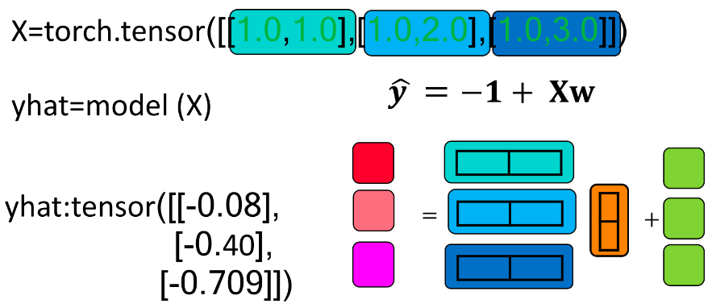
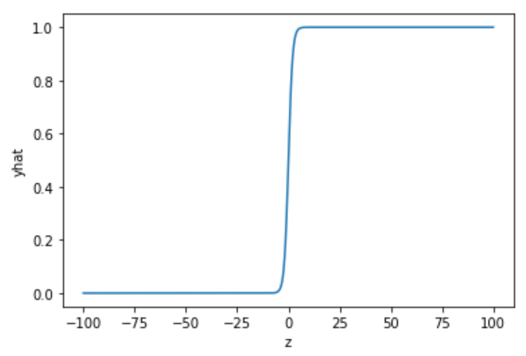

# Multiple LR

```python
from torch import nn
import torch

torch.manual_seed(1)
```

## Prediction

```python
# set weight & bias

w = torch.tensor([[2.0], [3.0]], requires_grad=True)
b = torch.tensor([[1.0]], requires_grad=True)

def forward(x):

    # torch.mm(): matrix multiplication
    yhat = torch.mm(x, w) + b

    return yhat

# calculate yhat
x = torch.tensor([[1.0, 2.0]])
yhat = forward(x)
```

### row of tensor x = one sample

```python
x = torch.tensor([[1.0, 1.0], [1.0, 2.0], [1.0, 3.0]])

yhat =prediction(x)
```

## Class linear

```python
model = nn.Linear(2, 1)

yhat = model(x)
```

+ matrix multiplication





## Build custom models

```python
class LR(nn.Module):

    def __init__(self, input_size, output_size):

        super(LR, self).__init__()
        self.linear = nn.Linear(input_size, output_size)

    def forward(self, x)

        yhat = self.linear(x)

        return yhat

model = LR(2, 1)

# randomly initialized params
print('parameters:', list(model.parameters()))
print('parameters:', model.state_dict())
```

# LR multiple outputs

```python
from torch import nn,optim
import torch
import numpy as np
import matplotlib.pyplot as plt

from mpl_toolkits.mplot3d import Axes3D
from torch.utils.data import Dataset, DataLoader

torch.manual_seed(1)

def Plot_2D_Plane(model, dataset, n=0):
    w1 = model.state_dict()['linear.weight'].numpy()[0][0]
    w2 = model.state_dict()['linear.weight'].numpy()[0][1]
    b = model.state_dict()['linear.bias'].numpy()

    # Data
    x1 = data_set.x[:, 0].view(-1, 1).numpy()
    x2 = data_set.x[:, 1].view(-1, 1).numpy()
    y = data_set.y.numpy()

    # Make plane
    X, Y = np.meshgrid(np.arange(x1.min(), x1.max(), 0.05), np.arange(x2.min(), x2.max(), 0.05))
    yhat = w1 * X + w2 * Y + b

    # Plotting
    fig = plt.figure()
    ax = fig.gca(projection='3d')

    ax.plot(x1[:, 0], x2[:, 0], y[:, 0],'ro', label='y') # Scatter plot
    
    ax.plot_surface(X, Y, yhat) # Plane plot
    
    ax.set_xlabel('x1 ')
    ax.set_ylabel('x2 ')
    ax.set_zlabel('y')
    plt.title('estimated plane iteration:' + str(n))
    ax.legend()

    plt.show()

class Data2D(Dataset):
    
    # Constructor
    def __init__(self):
        self.x = torch.zeros(20, 2)
        self.x[:, 0] = torch.arange(-1, 1, 0.1)
        self.x[:, 1] = torch.arange(-1, 1, 0.1)
        self.w = torch.tensor([[1.0], [1.0]])
        self.b = 1
        self.f = torch.mm(self.x, self.w) + self.b    
        self.y = self.f + 0.1 * torch.randn((self.x.shape[0],1))
        self.len = self.x.shape[0]

    # Getter
    def __getitem__(self, index):          
        return self.x[index], self.y[index]
    
    # Get Length
    def __len__(self):
        return self.len

# dataset object
data_set = Data2D()
```

## Create model, Optimizer, Cost

```python
class LR(nn.Module):

    def __init__(self, input_size, output_size):

        super(LR, self).__init__()
        self.linear = nn.Linear(input_size, output_size)

    def forward(self, x):

        yhat = self.linear(x)

        return yhat

model = LR(2, 1)
print('parameters:', list(model.parameters()))

# optimizer
optimizer = optim.SGD(model.parameters(), lr=0.1)

# cost
criterion = nn.MSELoss()

# data lodaer
trainloader = DataLoader(dataset, batch_size=2)
```

## Train model (Mini-batch grad descent)

```python
LOSS = []

print('before training:')

Plot_2D_Plane(model, data_set)

epochs = 100

def train_model(epochs):

    for epoch in range(epochs):

        for x, y in trainloader:

            yhat = model(x)

            loss = criterion(yhat, y)

            LOSS.append(loss.item())

            optimizer.zero_grad()

            loss.backward()

            optimizer.step()

train_model(epochs)

print('after training:')

Plot_2D_Plane(model, data_set, epochs)

plt.plot(LOSS)
plt.xlabel("Iterations")
plt.ylabel("Cost")
```

# LR multiple outputs

```python
import torch
import numpy as np
import matplotlib.pyplot as plt
from torch import nn,optim
from mpl_toolkits.mplot3d import Axes3D
from torch.utils.data import Dataset, DataLoader
import torchvision.transforms as transforms

torch.manual_seed(1)

class Data(Dataset):
    def __init__(self):
            self.x=torch.zeros(20,2)
            self.x[:,0]=torch.arange(-1,1,0.1)
            self.x[:,1]=torch.arange(-1,1,0.1)
            self.w=torch.tensor([ [1.0,-1.0],[1.0,3.0]])
            self.b=torch.tensor([[1.0,-1.0]])
            self.f=torch.mm(self.x,self.w)+self.b
            
            self.y=self.f+0.001*torch.randn((self.x.shape[0],1))
            self.len=self.x.shape[0]

    def __getitem__(self,index):

        return self.x[index],self.y[index]
    
    def __len__(self):
        return self.len

data_set=Data()
```

## Create model, Optimizer, Cost

```python
class LR(nn.Module):

    def __init__(self, input_size, output_size):

        super(LR, self).__init__()
        self.linear = nn.Linear(input_size, output_size)

    def forward(x):

        yhat = self.linear(x)

        return yhat

model = LR(2, 2)

optimizer = optim.SGD(model.parameters(), lr=0.1)

criterion = nn.MSELoss()

trainloader = DataLoader(dataset, batch_size=5)
```

## Train model (mini-batch grad descent)

```python
LOSS = []

epochs = 100

for epoch in range(epochs):

    for x, y in trainloader:

        yhat = model(x)

        loss = criterion(yhat, y)

        LOSS.append(loss.item())

        optimizer.zero_grad()

        loss.backward()

        optimizer.step()

plt.plot(LOSS)
plt.xlabel("iterations")
plt.ylabel("Cost")
plt.show()
```

# LR

```python
import torch.nn as nn
import torch
import matplotlib.pyplot as plt 

torch.manual_seed(2)
```

## Logistic function

```python
z = torch.arange(-100, 100, 0.1).view(-1, 1)
print("The tensor: ", z)

yhat = nn.Sigmoid()

plt.plot(z.numpy(), yhat.numpy())
plt.xlabel('z')
plt.ylabel('yhat')
```



## Logistic regression with nn.Sequential()

```python
X = torch.tensor([[1.0], [100]])

model = nn.Sequential(nn.Linear(1, 1),
                    nn.Sigmoid())

yhat = model(X)
print("The prediction: ", yhat)
```

## Build custom modules

```python
class LR(nn.Module):

    def __init__(self, n_inputs):

        super(LR, self).__init__()
        self.linear = nn.Linear(n_inputs, 1)

    def forward(self, x):

        yhat = torch.sigmoid(self.linear(x))

        return yhat

x = torch.tensor([[1.0]])
x = torch.tensor([[-100], [0], [100.0]])
model = LR(1)

x = torch.tensor([[1.0, 2.0]])
X = torch.tensor([[100, -100], [0.0, 0.0], [-100, 100]])
model = LR(2)

yhat = model(x)
print('prediction:', yhat)
```
# LR and Bad init value

```python
import numpy as np
import matplotlib.pyplot as plt 
from mpl_toolkits import mplot3d
import torch
from torch.utils.data import Dataset, DataLoader
import torch.nn as nn

class plot_error_surfaces(object):
    
    # Construstor
    def __init__(self, w_range, b_range, X, Y, n_samples = 30, go = True):
        W = np.linspace(-w_range, w_range, n_samples)
        B = np.linspace(-b_range, b_range, n_samples)
        w, b = np.meshgrid(W, B)    
        Z = np.zeros((30, 30))
        count1 = 0
        self.y = Y.numpy()
        self.x = X.numpy()
        for w1, b1 in zip(w, b):
            count2 = 0
            for w2, b2 in zip(w1, b1):
                Z[count1, count2] = np.mean((self.y - (1 / (1 + np.exp(-1*w2 * self.x - b2)))) ** 2)
                count2 += 1   
            count1 += 1
        self.Z = Z
        self.w = w
        self.b = b
        self.W = []
        self.B = []
        self.LOSS = []
        self.n = 0
        if go == True:
            plt.figure()
            plt.figure(figsize=(7.5, 5))
            plt.axes(projection='3d').plot_surface(self.w, self.b, self.Z, rstride=1, cstride=1, cmap='viridis', edgecolor='none')
            plt.title('Loss Surface')
            plt.xlabel('w')
            plt.ylabel('b')
            plt.show()
            plt.figure()
            plt.title('Loss Surface Contour')
            plt.xlabel('w')
            plt.ylabel('b')
            plt.contour(self.w, self.b, self.Z)
            plt.show()
            
     # Setter
    def set_para_loss(self, model, loss):
        self.n = self.n + 1
        self.W.append(list(model.parameters())[0].item())
        self.B.append(list(model.parameters())[1].item())
        self.LOSS.append(loss)
    
    # Plot diagram
    def final_plot(self): 
        ax = plt.axes(projection='3d')
        ax.plot_wireframe(self.w, self.b, self.Z)
        ax.scatter(self.W, self.B, self.LOSS, c='r', marker='x', s=200, alpha=1)
        plt.figure()
        plt.contour(self.w, self.b, self.Z)
        plt.scatter(self.W, self.B, c='r', marker='x')
        plt.xlabel('w')
        plt.ylabel('b')
        plt.show()
        
    # Plot diagram
    def plot_ps(self):
        plt.subplot(121)
        plt.ylim
        plt.plot(self.x, self.y, 'ro', label="training points")
        plt.plot(self.x, self.W[-1] * self.x + self.B[-1], label="estimated line")
        plt.plot(self.x, 1 / (1 + np.exp(-1 * (self.W[-1] * self.x + self.B[-1]))), label='sigmoid')
        plt.xlabel('x')
        plt.ylabel('y')
        plt.ylim((-0.1, 2))
        plt.title('Data Space Iteration: ' + str(self.n))
        plt.show()
        plt.subplot(122)
        plt.contour(self.w, self.b, self.Z)
        plt.scatter(self.W, self.B, c='r', marker='x')
        plt.title('Loss Surface Contour Iteration' + str(self.n))
        plt.xlabel('w')
        plt.ylabel('b')
        
# Plot the diagram

def PlotStuff(X, Y, model, epoch, leg=True):
    plt.plot(X.numpy(), model(X).detach().numpy(), label=('epoch ' + str(epoch)))
    plt.plot(X.numpy(), Y.numpy(), 'r')
    if leg == True:
        plt.legend()
    else:
        pass

torch.manual_seed(0)

class Data(Dataset):
    
    # Constructor
    def __init__(self):
        self.x = torch.arange(-1, 1, 0.1).view(-1, 1)
        self.y = torch.zeros(self.x.shape[0], 1)
        self.y[self.x[:, 0] > 0.2] = 1
        self.len = self.x.shape[0]
        
    # Getter
    def __getitem__(self, index):      
        return self.x[index], self.y[index]
    
    # Get Length
    def __len__(self):
        return self.len

data_set = Data()
```

## Model & Cost

```python
class LR(nn.Module):

    def __init__(self, n_inputs):

        super(LR, self).__init__()
        self.linear = nn.Linear(n_inputs, 1)

    def forward(self, x):

        yhat = torch.sigmoid(self.linear(x))
        return yhat

model = LR(1)

trainloader = DataLoader(dataset, batch_size=3)
criterion = nn.MSELoss()
optimizer = optim.SGD(model.parameters(), lr=2)
```

## Replace random initialized values

```python
model.state_dict() ['linear.weight'].data[0] = torch.tensor([[-5]])
model.state_dict() ['linear.bias'].data[0] = torch.tensor([[-10]])
```

## Train model (BGD)

```python
def train_model(epochs):

    for epoch in epochs:

        for x, y in trainloader:

            yhat = model(x)
            loss = criterion(yhat, y)
            optimizer.zero_grad()
            loss.backward()
            optimizer.step()

            get_surface.set_para_loss(model, loss.tolist())

        if epoch % 20 == 0:

            get_surface.plot_ps()

train_model(100)
```

+ get actual class of each sample & calculate acc on test set
  
```python
yhat = model(data_set.x)

label = yhat > 0.5

acc = torch.mean((label == data_set.y.type(torch.ByteTensor)).type(torch.float))

print('acc:', acc)
```

# LR training Negative Log likelihood (Cross-entropy)

```python
import numpy as np
import matplotlib.pyplot as plt
from mpl_toolkits import mplot3d
import torch
from torch.utils.data import Dataset, DataLoader
import torch.nn as nn

class plot_error_surfaces(object):
    
    # Construstor
    def __init__(self, w_range, b_range, X, Y, n_samples = 30, go = True):
        W = np.linspace(-w_range, w_range, n_samples)
        B = np.linspace(-b_range, b_range, n_samples)
        w, b = np.meshgrid(W, B)    
        Z = np.zeros((30, 30))
        count1 = 0
        self.y = Y.numpy()
        self.x = X.numpy()
        for w1, b1 in zip(w, b):
            count2 = 0
            for w2, b2 in zip(w1, b1):
                yhat= 1 / (1 + np.exp(-1*(w2*self.x+b2)))
                Z[count1,count2]=-1*np.mean(self.y*np.log(yhat+1e-16) +(1-self.y)*np.log(1-yhat+1e-16))
                count2 += 1   
            count1 += 1
        self.Z = Z
        self.w = w
        self.b = b
        self.W = []
        self.B = []
        self.LOSS = []
        self.n = 0
        if go == True:
            plt.figure()
            plt.figure(figsize=(7.5, 5))
            plt.axes(projection='3d').plot_surface(self.w, self.b, self.Z, rstride=1, cstride=1, cmap='viridis', edgecolor='none')
            plt.title('Loss Surface')
            plt.xlabel('w')
            plt.ylabel('b')
            plt.show()
            plt.figure()
            plt.title('Loss Surface Contour')
            plt.xlabel('w')
            plt.ylabel('b')
            plt.contour(self.w, self.b, self.Z)
            plt.show()
            
     # Setter
    def set_para_loss(self, model, loss):
        self.n = self.n + 1
        self.W.append(list(model.parameters())[0].item())
        self.B.append(list(model.parameters())[1].item())
        self.LOSS.append(loss)
    
    # Plot diagram
    def final_plot(self): 
        ax = plt.axes(projection='3d')
        ax.plot_wireframe(self.w, self.b, self.Z)
        ax.scatter(self.W, self.B, self.LOSS, c='r', marker='x', s=200, alpha=1)
        plt.figure()
        plt.contour(self.w, self.b, self.Z)
        plt.scatter(self.W, self.B, c='r', marker='x')
        plt.xlabel('w')
        plt.ylabel('b')
        plt.show()
        
    # Plot diagram
    def plot_ps(self):
        plt.subplot(121)
        plt.ylim
        plt.plot(self.x, self.y, 'ro', label="training points")
        plt.plot(self.x, self.W[-1] * self.x + self.B[-1], label="estimated line")
        plt.plot(self.x, 1 / (1 + np.exp(-1 * (self.W[-1] * self.x + self.B[-1]))), label='sigmoid')
        plt.xlabel('x')
        plt.ylabel('y')
        plt.ylim((-0.1, 2))
        plt.title('Data Space Iteration: ' + str(self.n))
        plt.show()
        plt.subplot(122)
        plt.contour(self.w, self.b, self.Z)
        plt.scatter(self.W, self.B, c='r', marker='x')
        plt.title('Loss Surface Contour Iteration' + str(self.n))
        plt.xlabel('w')
        plt.ylabel('b')
        
# Plot the diagram

def PlotStuff(X, Y, model, epoch, leg=True):
    plt.plot(X.numpy(), model(X).detach().numpy(), label=('epoch ' + str(epoch)))
    plt.plot(X.numpy(), Y.numpy(), 'r')
    if leg == True:
        plt.legend()
    else:
        pass

torch.manual_seed(0)

class Data(Dataset):
    
    # Constructor
    def __init__(self):
        self.x = torch.arange(-1, 1, 0.1).view(-1, 1)
        self.y = torch.zeros(self.x.shape[0], 1)
        self.y[self.x[:, 0] > 0.2] = 1
        self.len = self.x.shape[0]
    
    # Getter
    def __getitem__(self, index):      
        return self.x[index], self.y[index]
    
    # Get length
    def __len__(self):
        return self.len

data_set = Data()
```

## Create model & Cost

```python
class LR(nn.Module):

    def __init__(self, n_inputs):

        super(LR, self).__init()
        self.linear = nn.Linear(n_inputs, 1)

    def forward(self, x):

        yhat = torch.sigmoid(self.linear(x))

        return yhat

model = LR(1)

# set weight & bias
model.state_dict() ['linear.weight'].data[0] = torch.tensor([[-5]])
model.state_dict() ['linear.bias'].data[0] = torch.tensor([[-10]])
print("The parameters: ", model.state_dict())
```