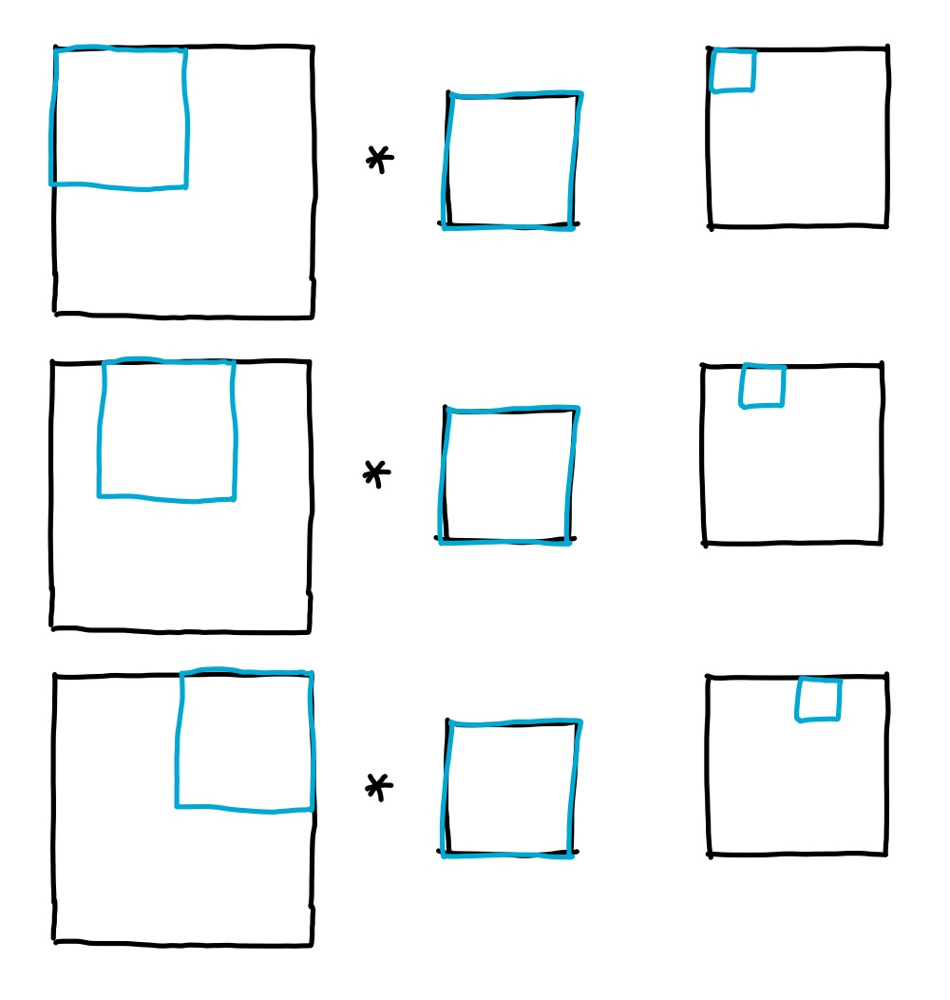
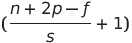
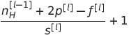

# Convolutional Neural Network

## Computer vision

Examples: Image classification, object detection, neural style transfer

Deep learning large images(large inputs)

= many params

= hard to get enough data to prevent overfitting

= computational & memory requirements are infeasible

&rarr; need to better implement convolution operation

## Edge detection

+ vertical edges
+ horizontal edges


__Ex of vertical edge detection__


Move along columns and rows:



```
python: conv_forward
tf: tf.nn.cont2d
keras: cont2d
```

## More edge detection

### Positive edge detection


### Negative edge detection


### Horizontal edge detection


### Sobel filter


+ more weight to the central pixel

### Scharr filter


__Letting the computer choose numbers of the filter__


If 3x3 filter, 9 params to train

## Padding

: Add p pixels to border of image

(n x n) image * (f x f) filter = ((n - f + 1) x ((n - f + 1)) output image

+ image shrinks ; if many layers, image gets too small
+ corners of image are used less than the inners

&rarr; Padding solves these problems

Ex. 6 x 6 &rarr; 8 x 8, number of padding pixels = 1

`Valid conv` : no padding

`Same conv` : output image size to be the same as the input image

(n + 2p - f + 1) x (n + 2p - f + 1)

∴ p = (f - 1) / 2

+ p is usually an odd number(has a center)

## Strided convolutions

: Moving s rows/columns

When stride = 2,


+ if  is not an integer, floor

## Convolutions over volume

### RGB image


### Using multiple channels


If n<sub>C</sub> = number of filters,

(n x n x n<sub>C</sub>) * (f x f x n<sub>C</sub>) = (n - f + 1) x (n - f + 1) x n<sub>C</sub>

## One layer of a convolutional network


= a layer

Z<sup>[1]</sup> = W<sup>[1]</sup>a<sup>[0]</sup> + b<sup>[1]</sup>

a<sup>[1]</sup> = g<sup>[1]</sup>(Z<sup>[1]</sup>)

If ten 3x3x3 filter,

(3 * 3 * 3 + bias) * 10 = 280 params

## Notations

+ f<sup>[ℓ]</sup> : filter size
+ p<sup>[ℓ]</sup> : padding
+ s<sup>[ℓ]</sup> : stride
+ n<sub>C</sub><sup>[ℓ]</sup> : number of filters
+ Input : n<sub>H</sub><sup>[ℓ-1]</sup> x n<sub>W</sub><sup>[ℓ-1]</sup> x n<sub>C</sub><sup>[ℓ-1]</sup>
+ Output : n<sub>H</sub><sup>[ℓ]</sup> x n<sub>W</sub><sup>[ℓ]</sup> x n<sub>C</sub><sup>[ℓ]</sup>
+ n<sub>H</sub><sup>[ℓ]</sup> = 
+ n<sub>W</sub><sup>[ℓ]</sup> = 
+ Each filter : f<sup>[ℓ]</sup> x f<sup>[ℓ]</sup> x n<sub>C</sub><sup>[ℓ-1]</sup>
+ Activations : a<sup>[ℓ]</sup> &rarr; n<sub>H</sub><sup>[ℓ]</sup> x n<sub>W</sub><sup>[ℓ]</sup> x n<sub>C</sub><sup>[ℓ]</sup>
+ If m examples,
  + A<sup>[ℓ]</sup> : m x n<sub>H</sub><sup>[ℓ]</sup> x n<sub>W</sub><sup>[ℓ]</sup> x n<sub>C</sub><sup>[ℓ]</sup>
  + weights : f<sup>[ℓ]</sup> x f<sup>[ℓ]</sup> x n<sub>C</sub><sup>[ℓ-1]</sup> x n<sub>C</sub><sup>[ℓ]</sup>
  + bias : 1 x 1 x 1 x n<sub>C</sub><sup>[ℓ]</sup>

## Simple convolution network example

### Types of layer in a convolutional network

+ convolution
+ pooling
+ fully-connected

## Pooling layers

### Max pooling


Common choice : f = 2, s = 2

+ f & s are hyperparams of max pooling
+ not to be learned by grad descent

### Average pooling


## Why convolutions?

### vs fully-connected layers

Number of params in conv layer remains small due to:

+ Param sharing : feature detector useful in a part is probably useful in another part of img
+ Sparsity of connections : in each layer, each output val depends only on a small numbers of inputs

Convolution structure helps NN to encode the fact that an image shifted should result in similar features & be assigned the same upon label

# Deep Convolutional Models : Case studies

## Classic Networks

### LeNet-5


+ input - conv - avg pool - conv - avg pool - FC - FC - output
+ n<sub>H</sub>, n<sub>W</sub> &darr;
+ n<sub>C</sub> &uarr;
+ uses sigmoid/tanh not sigmoid(didn't use non-linear func back then)

### AlexNet


+ similar to LeNet but much bigger
+ uses ReLU

### VGG-16


+ n<sub>H</sub>, n<sub>W</sub> &darr;
+ n<sub>C</sub> &uarr;
+ downside : large NN in terms of numbers of params to train

## ResNets (Residual Networks)

+ enables to train very deep networks(deep networks have vanishing/exploding gradient problem)
+ built out of `Residual block`
  + Plain network: 
    + a<sup>[ℓ]</sup> &rarr; linear &rarr; ReLU &rarr; a<sup>[ℓ+1]</sup> &rarr; linear &rarr; ReLU &rarr; a<sup>[ℓ]</sup> &rarr; a<sup>[ℓ+2]</sup>
    + a<sup>[ℓ+2]</sup> = g(z<sup>[ℓ+2]</sup>)
  + Residual block: 
    + a<sup>[ℓ]</sup> &rarr; ReLU &rarr; a<sup>[ℓ+2]</sup>
    + <sup>[ℓ+2]</sup> = g(z<sup>[ℓ+2]</sup> __+ a<sup>[ℓ]</sup>__)
+ 


### Why ResNets Work

Ex.


If using ReLU, all a's >= 0

a<sup>[ℓ+2]</sup> = g(z<sup>[ℓ+2]</sup> + a<sup>[ℓ]</sup>) = g(W<sup>[ℓ+2]</sup>a<sup>[ℓ+1]</sup> + b<sup>[ℓ+2]</sup> + a<sup>[ℓ]</sup>)

If using L2 regularization, W<sup>[ℓ+2]</sup> & b<sup>[ℓ+2]</sup> shrink

Assuming W<sup>[ℓ+2]</sup> = 0, b<sup>[ℓ+2]</sup> = 0,

a<sup>[ℓ+2]</sup> = g(z<sup>[ℓ+2]</sup> + a<sup>[ℓ]</sup>) = g(W<sup>[ℓ+2]</sup>a<sup>[ℓ+1]</sup> + b<sup>[ℓ+2]</sup> + a<sup>[ℓ]</sup>) = g(a<sup>[ℓ]</sup>) = a<sup>[ℓ]</sup> (∵ ReLU)

∴ a<sup>[ℓ+2]</sup> = a<sup>[ℓ]</sup>

+ z<sup>[ℓ+2]</sup> and a<sup>[ℓ]</sup> have same dimension
  + If not, use W<sub>s</sub> to adjust dimension (W<sub>s</sub> can be a param, or a fixed matrix)
  + a<sup>[ℓ+2]</sup> = g(z<sup>[ℓ+2]</sup> + W<sub>s</sub>a<sup>[ℓ]</sup>)

## Network in Network and 1x1 Convolutions

+ shrinks channel
  + shrinking width & height = pooling
+ save on computation
+ non-linearity

Ex.

To shrink channel(192 &rarr; 32),

: Use 32 1x1 filters


To keep channel as 192,


## Inception Network Motivation

### Inception module

: Training & stacking conv(1x1, 3x3, 5x5 filter) & max-pool(3x3) output to efficiently extract features


+ computational costs &uarr;&uarr; &rarr; `bottleneck layer` : adding 1x1 conv


## Inception Network


Input &rarr; stem (inception not effective) &rarr; Inception module repeated &rarr; FC ... Fc softmax (Output)


Softmax layers
+ helps param update
+ prevent output performance from getting worse
+ have regulation effect
+ prevent overfitting

## MobileNet

+ foundational CNN architecture used for computer vision
+ able to build & deploy new networks that work even in low compute environment(ex. mobile phone; less powerful CPU/GPU at deployment)

### Normal convolution vs Depthwise seperable convolution

In normal convolution,

(n x n x n<sub>C</sub>) * (f x f x n<sub>C</sub>') = n<sub>out</sub> x n<sub>out</sub> x n<sub>c</sub>'

n<sub>c</sub> : num of channels, n<sub>c</sub>' : num of filters

_Computational cost = num of filter param x num of filter positions x num of filters_

Ex. If 6x6x3 * 3x3x3 = 4x4x5,

then computational cost = (3x3x3) x (4x4) x 6 = 2160

In depthwise seperable convolution,

+ depthwise seperable convolution : input img * depthwise conv * pointwise conv = output

1) Depthwise convolution


Ex. 6x6x3 * 3x3 = 4x4x3,

then computational cost = (3x3) x (4x4) x 3 = 432

2) Pointwise convolution

(n<sub>out</sub> x n<sub>out</sub> x n<sub>c</sub>) * (1 x 1 x n<sub>c</sub>) = n<sub>out</sub> x n<sub>out</sub> x n<sub>c</sub>'

n<sub>c</sub> : num of channels, n<sub>c</sub>' : num of filters

Ex. 4x4x3 * 1x1x3 = 4x4x5,

then computational cost = (1x1x3)x (4x4) x 5 = 240

```
Normal : 2160
Depth + point : 672
```

Common ratio of computational costs in these cases is 1/n<sub>c</sub>' + 1/f<sup>2</sup>

## Mobile architecture

MobileNet v1


: the one explained above

MobileNet v2


Difference: 1) bottleneck residual connection 2) pointwise conv &rarr; projection

+ Expansion
  + increases size of representatino within the battleneck block, allowing the NN to learn a richer function
+ Projection
  + project the computation back to smaller set of values to be deployed in low compute environment like mobile phone

## EfficientNet

If more computation, bigger NN with more accuracy
If less computation, faster but less accuracy

&rarr; auto-scaling by EfficientNet

Choices:
+ Resolution of image
+ Depth of NN
+ Width of NN

## Practical Advice for Using ConvNets

### Transfer learning

: Download weights someone trained on the network architecture & use it as pre-training &rarr; transfer to new task

1) Download NN & weights
2) Get rid of softmax & create my own softmax units
3) Choose the front layers to freeze(don't train those layers' params) & train or get rid of the other layers except the softmax layer
   + num of layers to freeze ∝ amount of dataset

### Data augmentation

+ Mirroring
+ Random cropping(rotation, shearing, local warping, ...)
+ Color shifting
  + PCA algorithm: If image mainly has R & B tint, add/subtract R & B &rarr; keeps overall color of the tint the same

### Implementing distortion during training

CPU thread constantly loading imgs from hard disk
+ let CPU thread implement distortions (then pass img to training)
+ usually multithread

## The state of computer vision


Need:

+ labeled data (x, y)
+ hand-engineered features/network architecture/other components

## Tips for doing well on benchmarks/winning competitions

1) Ensembling: train several networks independently & average their output y hats
   1) never for serving customers
2) Multi-crops at test time
   