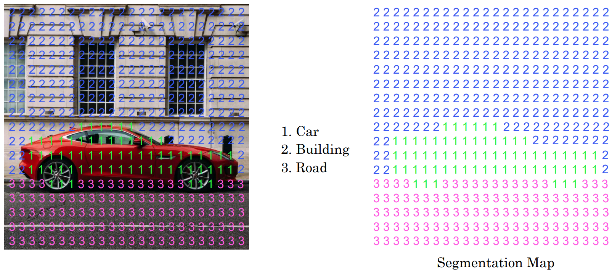
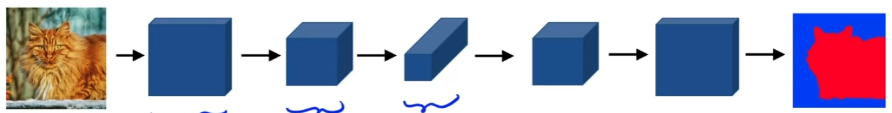
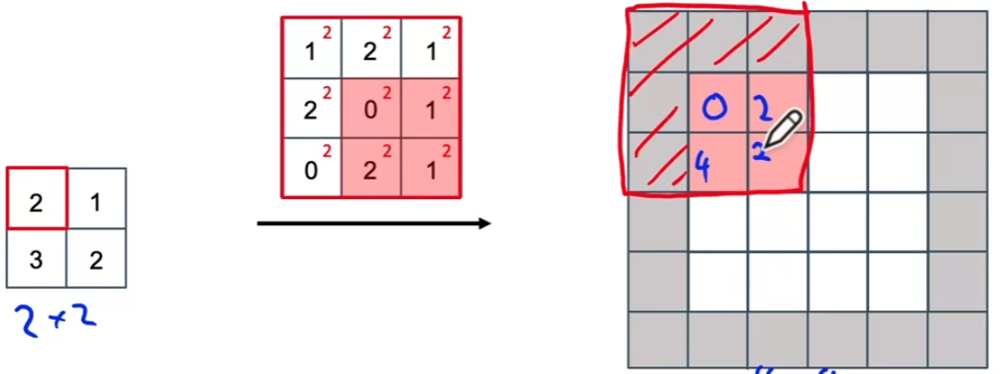
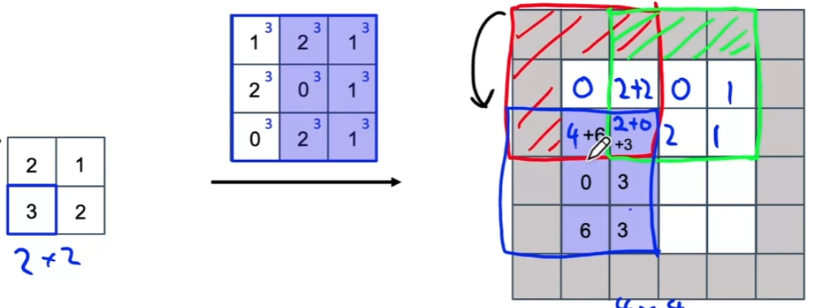

# Detection Algorithms

## Object Localization

: putting bounding box around the position of object

**Ex.** self-driving car

+ PC : Is there an object?
+ If PC = 0, else is 'don't care'

**Loss function**

## Landmark Detection

: image's landmark to (x, y) &rarr; generate label of landmarks in training set

## Object Detection

: using ConvNet to perform object detection with `Sliding Windows Detection Algorithm`

__Ex 1.__

input 14x14x3 *into* input 16x16x3, stride 2

output 1x1x4 *into* 2x2x4 (= four 1x1x4s)

After tuning FCs into Conv layers, converging part shares computation

## Bounding Box Predictions

`YOLO algorithm` : object classification/localization + Sliding window conv implementation

: 3x3 grid (output 3x3x8)

(common: 19x19 grid &rarr; output 19x19x8)

+ Image classification & Image localization applied to each cell, and get vector y

+ Set object's mid point (bx, by)

+ Each cell's upper left corner (0, 0), lower right (1, 1) &rarr; bx, by, bw, bh
  + bx and by : between 0~1
  + bw and bh could be over 1 (bounding box bigger than cell)

## Intersection over Union (IoU)

: used for evaluating object detection algorithm

maybe 0.6 if want strict result

## Non-max Suppression

So far problem: algorithm may find multiple detections of same object

1. Keep the box with the largest PC
2. Discard any remaining boxes of (IoU ≥ threshold) with the largest PC box; (IoU < threshold) is likely to be different class, if 2 or more classes

## Anchor Boxes

So far problem: able to detect only one object in a cell

+ Anchor box 1 similar to pedestrian
+ Anchor box 2 similar to car
+ Previously: output 3x3x8, Two anchor boxes: output 3x3x16 (3x3x2x8)

If there's an object, apply anchor boxes and check which one of anchor boxes has higher IoU

&rarr; encoded as (grid cell, anchor box) pair

## YOLO algorithm

Above: example of 2 anchor boxes, car object's bounding box has slightly higher IoU with 2nd anchor box(horizontal rectangle) than 1st anchor box

## Region Proposals

: pick few regions and run continent crossfire on just few windows rather than sliding windows on every single window

__Faster algorithms__

+ R-CNN: Propose regions. Classify proposed regions one at a time. Output label + bounding box.
+ Fast R-CNN: Propose regions. Use convolution implementation of sliding windows to classify all the proposed regions.
+ Faster R-CNN: Use convolutional network to propose regions.

## Semantic Segmentation with U-Net

`Segmantic Segmentation` : To draw carful outline around detected object. Useful for commercial application as well.

__Ex.__

+ Have to grow back up for output to be an image

## Transpose Convolutions

: Taking small set of activations and blowing up to a bigger set of activations

+ normal convolution: filter on input
+ transpose convolution: filter on output

**Ex.** f = 3, p = 1, s = 2

`1`

`2`

Padding area(in gray) has no value, so ignore

Input pixel value * filter value = output pixel

`3`

Overlapping pixels (in output image) &rarr; Add previous value

`4`

`5`

## U-Net Architecture

B needs
+ high level contextual info from previous layer
+ low level contextual info(what pixels are part of object) from A
  + prev layer missing detailed spatial info because of low spatial resolution

&rarr; Add skip connection

__The entire U-Net architecture__

+ Input image (h x w x 3) &rarr; Output image (h x w x nC)