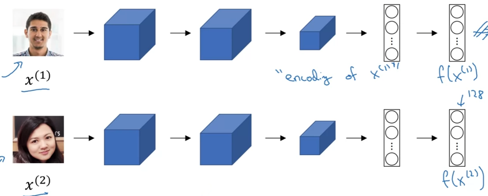
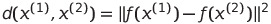
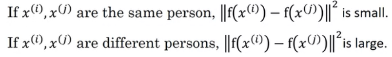
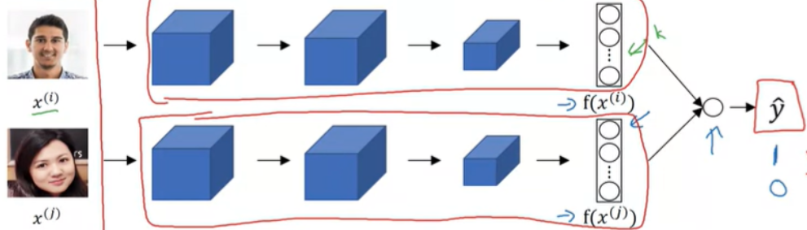
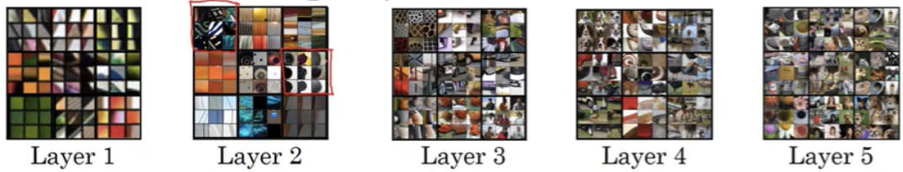
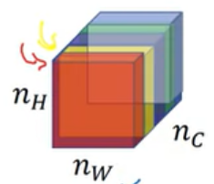

# Detection Algorithms

## Object Localization

: putting bounding box around the position of object

**Ex.** self-driving car


+ P<sub>C</sub> : Is there an object?
+ If P<sub>C</sub> = 0, else is 'don't care'

**Loss function**


## Landmark Detection

: image's landmark to (x, y) &rarr; generate label of landmarks in training set

## Object Detection

: using ConvNet to perform object detection with `Sliding Windows Detection Algorithm`


__Ex 1.__

input 14x14x3 *into* input 16x16x3, stride 2


output 1x1x4 *into* 2x2x4 (= four 1x1x4s)

After tuning FCs into Conv layers, converging part shares computation

## Bounding Box Predictions

`YOLO algorithm` : object classification/localization + Sliding window conv implementation


: 3x3 grid (output 3x3x8)

(common: 19x19 grid &rarr; output 19x19x8)

+ Image classification & Image localization applied to each cell, and get vector y

+ Set object's mid point (b<sub>x</sub>, b<sub>y</sub>)

+ Each cell's upper left corner (0, 0), lower right (1, 1) &rarr; b<sub>x</sub>, b<sub>y</sub>, b<sub>w</sub>, b<sub>h</sub>
  + b<sub>x</sub> and b<sub>y</sub> : between 0~1
  + b<sub>w</sub> and b<sub>h</sub> could be over 1 (bounding box bigger than cell)

## Intersection over Union (IoU)

: used for evaluating object detection algorithm


maybe 0.6 if want strict result

## Non-max Suppression

So far problem: algorithm may find multiple detections of same object


1. Keep the box with the largest P<sub>C</sub>
2. Discard any remaining boxes of (IoU ≥ threshold) with the largest P<sub>C</sub> box; (IoU < threshold) is likely to be different class, if 2 or more classes

## Anchor Boxes

So far problem: able to detect only one object in a cell


+ Anchor box 1 similar to pedestrian
+ Anchor box 2 similar to car
+ Previously: output 3x3x8, Two anchor boxes: output 3x3x16 (3x3x2x8)

If there's an object, apply anchor boxes and check which one of anchor boxes has higher IoU

&rarr; encoded as (grid cell, anchor box) pair

## YOLO algorithm


Above: example of 2 anchor boxes, car object's bounding box has slightly higher IoU with 2nd anchor box(horizontal rectangle) than 1st anchor box

## Region Proposals

: pick few regions and run continent crossfire on just few windows rather than sliding windows on every single window


__Faster algorithms__

+ R-CNN: Propose regions. Classify proposed regions one at a time. Output label + bounding box.
+ Fast R-CNN: Propose regions. Use convolution implementation of sliding windows to classify all the proposed regions.
+ Faster R-CNN: Use convolutional network to propose regions.

## Semantic Segmentation with U-Net

`Segmantic Segmentation` : To draw carful outline around detected object. Useful for commercial application as well.


__Ex.__


+ Have to grow back up for output to be an image


## Transpose Convolutions

: Taking small set of activations and blowing up to a bigger set of activations


+ normal convolution: filter on input
+ transpose convolution: filter on output

**Ex.** f = 3, p = 1, s = 2

`1`


`2`


Padding area(in gray) has no value, so ignore

Input pixel value * filter value = output pixel

`3`


Overlapping pixels (in output image) &rarr; Add previous value

`4`


`5`


## U-Net Architecture


B needs
+ high level contextual info from previous layer
+ low level contextual info(what pixels are part of object) from A
  + prev layer missing detailed spatial info because of low spatial resolution

&rarr; Add skip connection


__The entire U-Net architecture__


+ Input image (h x w x 3) &rarr; Output image (h x w x n<sub>C</sub>)

# Face Recognition

## What is Face Recognition?

+ Verification
  + input: image, name/ID
  + output: input image = claimed person?
+ Recognition
  + database of k person
  + input: image
  + output: ID if the person ∈ database

## One-shot learning

: learning from 1 example to recognize the person again

__Ex.__

Image &rarr; CNN &rarr; softmax(5)

: have to update each time a new person joins

&rarr; Use `Similarity function d(img1, img2)`

d(img1, img2) = degree of difference between images

**Verification**

```
If d(img1, img2) ≤ τ : same person

If d(img1, img2) > τ : different person
```

**Recognition**

```
d(for img1 in database, img2) = small value : person is in the database
```

## Siamese Network



f(x<sup>(1)</sup>) : encoding of x<sup>(1)</sup>

&rarr; 



## Triplet Loss

: to get good encoding for pics, define & apply GD on triplet loss function


+ Encoding of Anchor & Positive : similar
+ Encoding of Anchor & Negative : far apart


`α` : margin

+ to assure NN doesn't just output 0 because all encodings are the same
+ makes A-P and A-N get further apart
  + __Ex.__ d(A, P) = 0.5, d(A, N) = 0.51
    + wo margin, d(a, N) is larger even they are different person
    + w margin of 0.2, makes rather d(a, P) = 0.7 or d(A, N) = 0.3

## Triplet Loss Function

Given 3 imgs A, P, N:


+ Make trimplets out of dataset images
+ Need to have pairs of (A, P) at least for training set

## Choosing Triplets

+ Randomly chosen: d(A, P) & d(A, N) too easily satisfied
+ Choose triplets that are hard to train on
  + d(A, P) + α ≤ d(A, N) satisfied
  + low d(A, P) ≈ high d(A, N)

## Face Verification & Binary Classification

### ConvNet params training ways

1) Triplet Loss
2) Face recognition into Binary classification



Encodings of images into logistic regression &rarr; ŷ (0: same, 1: different)

**Formulas finding gap between encodings**


_or_


# Neural Transfer

## What is Neural Style Transfer


## What are deep ConvNets learning?

Visualize what each of layers are computing

&rarr; shallow layers: simple features(edge, particular shade of color)

&rarr; deep layers: larger region of image



: image patches

+ red boxes = 9 patches that cause one hidden unit to be highly activated

# Cost Function

`J(G)` = α J <sub>Content</sub>(C, G) + β J<sub>Style</sub>(S, G)

+ α, β: hyperparameters
+ J <sub>Content</sub>(C, G) : measures how similar G is to C
+ J<sub>Style</sub>(S, G) : measures how similar G is to S

Find generated image G

1) Initiate G randomly &rarr; random noise image
2) Use gradient descent to minimize J(G)
     + G := G - α/2G * J(G)

## Content Cost Function

+ when hidden layer ℓ(not too shallow nor deep) computes content cost
+ use pre-trained ConvNet and find how similar C&G are
+ a<sup>[ℓ] (C)</sup> & a<sup>[ℓ] (G)</sup> : activation of layer ℓ on imgs
+ If a<sup>[ℓ] (C)</sup> & a<sup>[ℓ] (G)</sup> are similar, both imgs have similar content

&rarr; J<sub>Content</sub>(C, G) = 1/2 * || a<sup>[ℓ] (C)</sup> - a<sup>[ℓ] (G)</sup> ||<sup>2</sup>

## Style Cost Function

`Style of img` : correlation between activations across channels

__Ex.__ output of layer ℓ : n<sub>H</sub> x n<sub>W</sub> x n<sub>C</sub> (left), image patches of layer ℓ (right)

 

+ Red colored channel = image patches in red(vertical lines)
+ Yellow colored channel = iamge patches in yellow(brownish-orangish shades)
+ If two channels are highly correlated, vertical lines are likely to be in brownish-orangish shade at the same time

__Style Matrix__ : above formulized

Let a<sub>i, j, k</sub><sup>[ℓ]</sup> : activation at (n<sub>H</sub> = i, n<sub>W</sub> = j, n<sub>C</sub> = k)

and G[ℓ] : n<sub>C</sub><sup>[ℓ]</sup> x n<sub>C</sub><sup>[ℓ]</sup>


+ k,  k' is 1~n<sub>C</sub>
+ correlated : G<sub>kk'</sub><sup>[ℓ]</sup> high

__Style Cost Function__


lamdba : hyperparameter

## 1D & 3D Generalization

__Ex.__ 14x14x14 * 5x5x5 = 10x10x10 _x1 (channel)_

__Ex.__ 14x14x14x1 * 5x5x5(16 filters) = 10x10x10x16