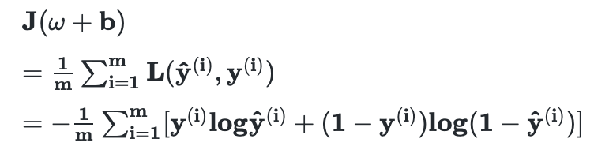
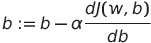

# Introduction to Deep Learning

## Neural Network


+ Stack single neurons &rarr; Larger neural network


+ Each of hidden units takes its inputs all input features

__To manage neural network__

1. Give the input x and output y for a number of examples in the training set.
2. Then it will figure out the hidden layers part by itself.


## Supervised Learning

: input x and output y are cleverly selected and given

+ Structured Data : database
+ Unstructured Data : audio, image, text, ...
  + computers are now much better at interpreting unstructured data (thanks to neural networks and deep learning)

## Why is Deep Learning taking off?


For high level performance, you need

1) to be able to train a __big enough neural network__
2) a lot of __data__

&rarr; the scales driving the deep learning progress

+ `data`
+ `computation`
    1. implement the idea 
    2. code
    3. run experiment
    4. repeat in cycle
+ `algorithms` : making NN run much faster
  + ex. Sigmoid function &rarr; ReLU function
      
    + gradient nearly 0, learning becomes slow
        


## __Logistic Regression__ as a Neural Network

### Logistic Regression for `Binary Classification`

+ Give an image represented as X as the input and train the classifier &rarr; Predict if the output label y is rather 0 or 1
+ Given X, want ŷ to be P(y=1|x)

__ŷ = σ(w<sup>T</sup>x+b), where σ(z) = 1/1+e<sup>-z</sup> (Z = w<sup>T</sup>x+b)__

```
x, w : dimensional vector
b : real number
```

+ ŷ<sup>(i)</sup> = σ(w<sup>T</sup>x<sup>(i)</sup>+b), where σ(Z<sup>(i)</sup>) = 1/1+e<sup>-z<sup>(i)</sup></sup> (Z<sup>(i)</sup> = w<sup>T</sup>x<sup>(i)</sup>+b)

  + Given { (x<sup>(1)</sup>, y<sup>(1)</sup>), (x<sup>(2)</sup>, y<sup>(2)</sup>), ... , (x<sup>(i)</sup>, y<sup>(i)</sup>) }
  + want ŷ<sup>(i)</sup> ≈ y<sup>(i)</sup>

### __Loss(error) function__

+ Measures how well the algorithm outputs

𝐿(ŷ, y) = 1/2(ŷ - y)<sup>2</sup> &rarr; (x), optimization problem

In Logistic Regression &rarr; __𝑳(ŷ, y) = -(ylogŷ + (1-y)log(1-ŷ))__

+ If y = 1, 𝐿(ŷ, y) = -logŷ
  + want logŷ to be large
  + want ŷ to be large

+ If y = 0, 𝐿(ŷ, y) = -log(1-ŷ)
  + want log(1-ŷ) to be large
  + want ŷ to be small

### __Cost function__

+ Measures how well the parameters w and b are doing on the training set (want to find w and b that minimize J(w, b))
+ Convex function(single big bowl) &rarr; No matter what point (w, b) you initialize, it gets to (roughly) the same point (usually initialize the values of 0)




## __Gradient Descent__

+ Starts at the initial point(w, b) and moves in downhill direction of the cost function &rarr; Converge to the global optimum
+ Repeat w:=w-αdw (α: learning rate, dw: slope of the function) &rarr; want to know dw at the current setting of the parameters w and b
  
, 

### Computating derivatives

+ `Going backwards`, see the net change to the FinalOutputVariable when you bump up Var(the chain rule) &rarr; Optimize FinalOutputVariable
+ d FinalOutputVariable / d Var

### Logistic Regression Gradient Descent

: Implementing gradient descent for logistic regression

When Z = w<sup>T</sup>x+b, ŷ = a = σ(z),  𝐿(a, y) = -(yloga + (1-y)log(1-a)) and
+ features X1, X2
+ input W1, W2, b
+ Computation Graph: z = w<sub>1</sub>x<sub>1</sub> + w<sub>2</sub>x<sub>2</sub> + b &rarr; a = σ(z) &rarr; 𝐿(a, y)
+ Then (going backwards) da = d𝐿(a, y) / da &rarr; dz = dL / dz &rarr; dw<sub>1</sub> = x<sub>1</sub>dz, dw<sub>2</sub> = x<sub>2</sub>dz, db = dz
  + da = -(y/a) + (1-y)/(1-a), dz = a - y

### Gradient descent on m examples

+ One training sample (x<sup>(i)</sup>, y<sup>(i)</sup>)
+ The overall cost functions as the average of individual losses


+ J=0, dw<sub>1</sub>=0, dw<sub>2</sub>, db=0

#### **Computing derivatives of the cost function J with respect of each parameters w<sub>1</sub>, w<sub>2</sub>, b**
  
1.  for i=1 to m:

+ z<sup>(i)</sup> = w<sup>T</sup>x<sup>(i)</sup>+b

+ a<sup>(i)</sup> = (z<sup>(i)</sup>)

+ J += [y<sup>(i)</sup>loga<sup>(i)</sup> +(1-y<sup>(i)</sup>)log(1-a<sup>(i)</sup>)]

+ dz<sup>(i)</sup> = a<sup>(i)</sup> - y<sup>(i)</sup>

+ dw<sub>1</sub> += x<sub>1</sub><sup>(i)</sup>dz<sup>(i)</sup>

+ dw<sub>2</sub> += x<sub>2</sub><sup>(i)</sup>dz<sup>(i)</sup>

+ (assuming there are just 2 features; if more features, use for loop)
2. J /= m
3. dw<sub>1</sub> /= m; dw<sub>2</sub> /= m; db /= m

&rarr; dw<sub>1</sub> & dw<sub>2</sub> & db are accumulators `so` after the computation, dw<sub>1</sub> = dJ / dw<sub>1</sub>

&rarr; w<sub>1</sub> := w<sub>1</sub> - dw<sub>1</sub>

&rarr; w<sub>2</sub> := w<sub>2</sub> - dw<sub>2</sub>

&rarr; b := b - db

# Vectorization

+ Whenever possible, avoid explicit for loops
+ Z = np.dot(w, x) + b

```python
import numpy as np
import time

a = np.random.rand(1000000)
b = np.random.rand(1000000)
tic = time.time()
c = np.dot(a, b)
toc = time.time()

print(c)
print('vectorized version: ' + str(1000*(toc-tic)) + 'ms')

c = 0
tic = time.time()
for i in range(1000000):
    c += a[i] * b[i]
toc = time.time()

print(c)
print('for loop: ' + str(1000*(toc-tic)) + 'ms')

# 249655.51040772663
# vectorized version: 0.9698867797851562ms
# 249655.51040772724
# for loop: 250.54287910461426ms
```
## Vectorizing Logistic Regression

__Computing all the `z`'s at the same time__

[z<sup>(1)</sup> z<sup>(2)</sup> ... z<sup>(m)</sup>]

= w<sup>T</sup>X + [b b ... b]

`Broadcasting` : Python automatically expands the real number out to a 1 by m row vector

= [w<sup>T</sup>x<sup>(1)</sup>+b w<sup>T</sup>x<sup>(2)</sup>+b ... w<sup>T</sup>x<sup>(m)</sup>+b]

= [Z<sup>(1)</sup> Z<sup>(2)</sup> ... Z<sup>(m)</sup>]

= Z = np.dot(w<sup>T</sup>, x) + b

**Computing all the `a`'s all at the same time**

A = [a<sup>(1)</sup> a<sup>(2)</sup> ... a<sup>(m)</sup>]
  = σ(Z)

### __Vectorizing Logistic Regression's Gradient Output__

+ dz<sup>(i)</sup> = a<sup>(i)</sup> - y<sup>(i)</sup>

dZ = [dz<sup>(1)</sup> dz<sup>(2)</sup> ... dz<sup>(m)</sup>]

A = [a<sup>(1)</sup> a<sup>(2)</sup> ... a<sup>(m)</sup>]

Y = [y<sup>(1)</sup> y<sup>(2)</sup> ... y<sup>(m)</sup>]

&rarr; dZ = A - Y = [a<sup>(1)</sup>-y<sup>(1)</sup> a<sup>(2)</sup>-y<sup>(2)</sup> ... a<sup>(m)</sup>-y<sup>(m)</sup>]

__Vectorizing the inner for loop__

ex.

+ dw, db = 0, 0
+ for i=1 to m
  + ...
  + dw += x1<sup>(i)</sup>dz<sup>(i)</sup>
  + db += dz<sup>(i)</sup>

&rarr; db = (1/m) * Σ<sup>m</sup><sub>i=1</sub>dz<sup>(i)</sup> = (1/m)*np.sum(dZ)

&rarr; dw = (1/m)*dZ<sup>T</sup>

### __Implementing Logistic Regression__

Z = np.dot(w<sup>T</sup>, x) + b

A = σ(Z)

dZ = A - Y

dw = (1/m)*dZ<sup>T</sup>

db = (1/m)*np.sum(dZ)