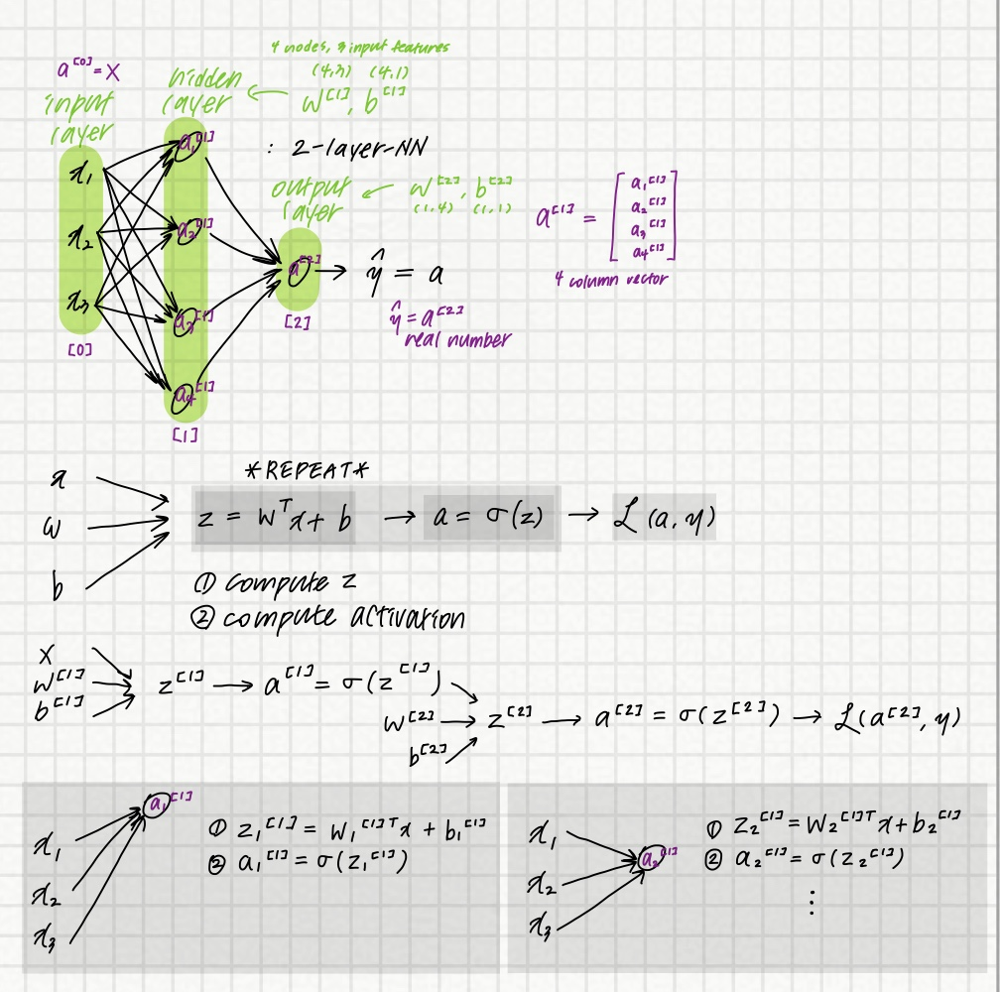
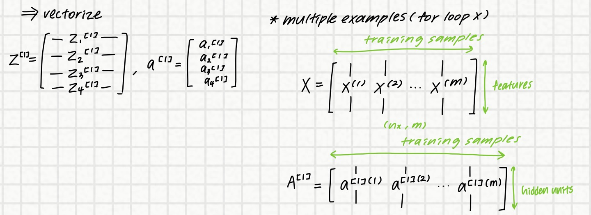
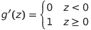

# Shallow Neural Network

## Neural network

## Vectorizing

## Activation Functions

: non-linear function
: use different activation functions in different layers

### 1. Sigmoid function

### 2. tanh(z)

+ shifted version of sigmoid function
+ Pro: the activation mean of hidden layer is near to 0 &rarr; centers the data &rarr; makes learning in the next layer easier
+ For binary classification, it's better to use tanh(z) for hidden layer and use sigmoid function for the output layer
  + output layer has value between 0 & 1 but tanh(z) has value between -1 & 1
+ Con: when z is very big or small, derivative becomse very small

1. ReLU

+ Pro: much faster than sigmoid / tanh
+ Con: if z < 0, derivative = 0
+ default choice of activation func

1. leaky ReLU

+ Pro: for a lot of space of z, the derivative of the activation func is not 0

## Derivative of activation funcs

### 1. Sigmoid function

### 2. tanh(z)

g'(z) = 1 - (tanh(z))2

### 3. ReLU

### 4. leaky ReLU

## Gradient descent for NNs

Repeat:
- compute [ŷ(i), i = 1 ~ n]
- compute dw[1] = dJ / dw[1], db[1] = dJ / db[1], ...
- W[1] := W[1] - αdw[1]
- b[1] := b[1] - αdb[1]
- W[2] := W[2] = αdw[2]
- b[2] := W[2] = αdb[2]

__Forwal propagation__

Z[1] = W[1]X + b[1]

A[1] = g[1](Z[1])

Z[2] = W[2]A[1] + b[2]

A[2] = g[2](Z[2]) = σ(Z[2])

__Backward propagation(Computing derivative)__

dZ[2] = A[2] - Y

dW[2] = (1/m) * dZ[2]A[1]T

db[2] = (1/m) * np.sum(dZ[2], axis=1, keepdims=True)

dZ[1] - W[2] * g[1]'(Z[1])

dW[1] = (1/m) * dZ[1]XT

db[1] = (!/m) * np.sum(dZ[1], axis=1, keepdims=True)

## Random Initialization

If weight initialized as 0,

&rarr; the units in a layer will be symmetric & have same influence to the next layer - `symmetric breaking problem`

ex.

W[1] = np.random.randn((2,2)* 0.01)

b[1] = np.zero((2,1))

W[2] = np.random.randn((1,2) * 0.01)

b[2] = np.zero((1,1))

__Why 0.01?__

+ if too big, activation function will be saturated thus slowing down learning when using sigmoid / tanh

# Deep Neural Network

layer &uarr;&uarr; : deep NN

## Why deep NN works well?

+ lower level simple features in small area &rarr; detect more complex things

L : number of layers

n[_l_] = number of units in layer

a[_l_] = activations in layer _l_

w[_l_] = weights for z[_l_]

## Forward propagation

z[_l_] = w[_l_]a[_l-1_] + b[_l_]

a[_l_] = g[_l_](z[_l_])

__vectorize__

Z[1] = W[1]X + b[1] (X = A[0])

A[1] = g[1](Z[1])

Z[2] = W[2]A[1] + b[2]

A[2] = g[2](Z[2])

...