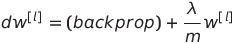
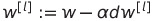
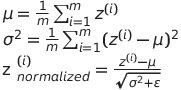
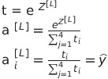

# Practical Aspects of Deep Learning

## Setting up your ML Application

### Train / Dev / Test

+ Training set : experiment &rarr; idea &rarr; code cycle
+ Dev set
+ Test set

Previous era of ML: 70/30 or 60/40/40

Big Data era: 1M/10K(big enough)/10K = 98/1/1

### Bias / Variance

+ high bias = underfitting
+ high variance = overfitting

|train set error|dev set error|description|
|------|---|---|
|1%|11%|high variance|
|15%|16% (bad)|high bias|
|15%|30% (even worse)|high var & bias|
0.5%|1%|low var & bias|

### Basic Recipe for ML

1. If high bias
+ bigger network
+ train longer
+ find better network architecture suited for this problem
2. If high variance
+ more data
+ regularization
+ find better network architecture suited for this problem

## Regularizing NN

### Regularization
일반화, 정규화

+ to tune function by adding additional penalty term in the cost function
+ reduces 'overfitting' (high variance)

**Implementing 'L2 Regularization' for Logistic Regression**

+ Penalizes w matrices from being too large
+ Frobenious norm of matrix w : sum of square of elements of matrix w

+ Row i of the matrix = #neurons in current layer; n[l]
+ Column j of the matrix = #neurons in previous layer; n[l-1]

+ CON: makes searching over many values of lambda more computationally expensive (have to try a lot of values fo the regulation parameter lambda)

__Implementing Gradient Descent__

1. 

2. 

+ L2 regulation = 'Weight Decay'
+ w(1-αλ/m), makes w to be a little smaller

### Why Regularization Reduces Overfitting?

1. If λ is set as a large value, w will be set as a number close to 0
+ NN is simplified by reducing impacts of hidden units, the NN becomes as if logistic regression is deeply stacked

2. When g(z)=tanh(z) and z is quite small = using tanh's linear part
+ 
+ Every layer = roughly linear &rarr; the whole network = linear network
+ Unable to fit complicated decision (overfit)

### Dropout Regularization

'Dropout'
+ Stronger regularization technique than L2
+ Going through each layer and set possibility of eliminating a node in NN

__Implementing Dropout__

1. Inverted Dropout: the most common way

'''python
d3 = np.random.rand(a3.shape[0], a3.shape[1]) < keep_prob
#vector d3 : dropout vector of layer 3
# same shape as a3

a3 *= d3
# activations to compute
# element-wise multiplication

a3 /= keep_prob
# in z = wa + b, a is reduced
# to not reduce value of z, bump up back a3
'''
ex. 50 units in 3rd hidden layer, a3 is (50, 1) vector, keep_prob = 0.8 (0.2 chance of eliminating any hidden unit)

&rarr; 10 units zeroed out

+ Units have possibilities of getting eliminated so weights should be spread out rather than focused on specific units
+ vs L2 regulation: applying to different weights and adaptive to different inputs
+ Can set keep_prob different for each layer

### Other Regularization Methods

1. If getting more data is unable, make distortions & translations of images - make random crops of the image by flipping or rotating then add them to the training set
2. Early stopping
1. as running gradient descent, plot training error & devset error
2. If haven't run many iterations, w is close to w; stopping when w has the mid-size rate will minimize dev set error
+ 
+ CON: no longer can work computing w, b that minimizes cost function J and reducing variance to prevent overfitting independently

## Setting up Optimization Problem

### Normalizing Inputs

 (two input features)

1. Subtract out(zero out) the mean

X = X - µ (for every training example)

&rarr; mean = 0

2. Normalize variance

+ original &rarr; subtract out the mean &rarr; normalize variance

&rarr; Enables to find the minimum value of J faster and easier using gradient descent algorithm

### Vanishing / Exploding Gradients

+ When training very deep network, derivatives can get either very big/small, making training difficult
+ &rarr; choose random w initialization carefully to reduce this problem

+ if w's are all a little bigger than 1 or the identity matrix, then with a very deep NN, the activations can explode
+ if w is little less than identity, with a very deep NN, the activations will decrease exponentially
+ if activations' gradients increase/decrease exponentially as a func of L, values get really big/small

### Weight Initialization for Deep Networks

+ If ReLU,

W[l] = np.random.randn('shape') * np.sqrt(2/n[l-1])

+ If tanh, (Xavier initialization)

W[l] = np.random.randn('shape') * np.sqrt(1/n[l-1])

or

W[l] = np.random.randn('shape') * np.sqrt(1/(n[l-1]+n[l]))

### Gradient Checking

+ Makes sure the implementation of back prop is correct and find bugs in the implementations

1. Reshape all parameters into a giant vetor data

W[1], b[1], ..., W[L], b[L] &rarr; big vector θ

+ J(W[1], b[1], ..., W[L], b[L]) = J(θ)
+ dW[1], db[1], ..., dW[L], db[L] = dθ

2. Check if dθ is the gradient of J(θ)

for each i:
+ dθapprox(i) = (J(θ1, θ2, ..., θi + ε, ...) - J(θ1, θ2, ..., θi - ε, ...)) / 2ε

&rarr; debug - search for a specific i that has a very different value of dθi

__Practical tips of implementing grad checking__

<<<<<<< HEAD
1. Don't use in training - only to debug
+ Grad checking is a very slow computation so to implement grad descent, just use back prop to compute dθ
2. If algorithm fails grad check, look at components to try to identify bu of dθapprox[i] is far from dθ, look at different values of i to see which are the values of dθapprox[i]
+ those values came from dW[l] of a certain layer
=======
1. Don't use in training - only to debug 
   + Grad checking is a very slow computation so to implement grad descent, just use back prop to compute dθ
2. If algorithm fails grad check, look at components to try to identify bug if dθapprox[i] is far from dθ, look at different values of i to see which are the values of dθapprox[i]
   +  those values came from dW[l] of a certain layer
>>>>>>> 1b5ee5ed064c601629b1618abde306f451c3a759
3. Doesn't work with Dropout
+ set keep_prob = 1.0
4. Back prop implementation might be incorrect when w, b are big, so run grad check at random initialization & train the network for a while so that w, b have some time to wander away from the initial values, then grad check again after training for some numbers of iterations

# Optimization Algorithms

: enables training NN much faster

## Mini-batch Gradient Descent

+ Training NN can be slow even after vectorization when m(#training samples) is very big
+ Starting grad descent before processing the entire training set

1. Split up training set into smaller sets

+ X : (nx, m), m = 5M,

x(1) ~ x(1000) = X{1} (nx, 1000)

x(1001) ~ x(2000) = X{2} (nx, 1000)

...

~ x(m) = X{5000} (nx, 1000)

+ Y : (1, m)

y(1) ~ y(1000) = Y{1} (1, 1000)

y(1001) ~ y(2000) = Y{2} (1, 1000)

...

y(1) ~ y(1000) = Y{1} (1, 1000)

2. Repeat

for t=1~5000:
+ forward prop on X{t}
+ Z[1] = W[1]X{t} + b[1]
+ A[1] = g[1](Z[1])
+ ...
+ A[L] = g[L](Z[L])
+ compute cost func J{t}
+ back prop to compute grad w respect to J{t} (using X{t}, Y{t})
+ W[l] := W[l] - αdW[l]
+ b[l] := b[l] - αdb[l]

__Batch grad descent__
+ 1 pass through training set = 1 grad descent step
+ cost should go down on every iteration

__Mini-batch grad descent__
+ 1pass through training set = 1 epoch(a single pass through the training set)
+ cost doesn't go down on every iteration; noisy but trends downwards
+ if size of mini batch = 1 &rarr; "stochastic grad descent"
+ if size of mini batch = somewhere between 1~m &rarr; fastest learning
+ get lots of vectorization
+ can make progress without needing to wait until processing the entire training set

__Tips to choose the size of mini-batch__

1. If training set is small, use batch grad descent

2. Typical mini-batch sizes: 64, 128, 256, 512

3. Make sure all X{t}, Y{t} fits in CPU/GPS memory

## Exponentially Weighted Averages

θ1, θ2, ..., θ3 : actual values of samples(ex. temperature in London)

V0 = 0

Vt = βVt-1 + (1-β)θt

+ if β = 0.9, averaging about over last 10 days (red)
+ if β = 0.98, averaging about over last 50 days (green)
+ if β = 0.5, averaging about over last 2 days (red)
+ β is larger = giving more weight to the previous value

__How many days?__

+ ε = 1 - β, (1 - ε)1/ε ≈ 1/e

ex. if β = 0.9, ε = 0.1

(0.9)10 ≈ 1/e

∴ about 10 days

+ takes very little memory
+ 1 line code

## Bias Correction in Exponentially Weighted Averages

V0 = 0

V1 = βV0 + (1-β)θ1

&rarr; βV0 = 0, exponentially weighted average starts off lower than accurate value

Instead of Vt, use Vt/(1-βt)

+ as t gets larger, βt gets closer to 0

## Better optimization algorithms

### Gradient Descent with Momentum

+ to compute exponentially weighted average of gradients, then use grad to upgrade weights
+ larger learning rate = oscillations
+ slow down grad descent
+ prevent using larger learning rate
+ on vertical axis, want learning to be slower because want to get rid of oscillations
+ on horizontal axis, want learning to be faster

on iteration t:
+ compute dw, db on current mini-batch
+ Vdw = βVdw + (1-β)dw
+ Vdb = βVdb + (1-β)db
+ β : friction(commonly set to 0.9), dw & db : acceleration to a bowl to roll downhill
+ w := w - αVdw, b := b - αVdb
+ to smooth out the steps of grad descent

### RMSprop

+ root mean square prop
+ enables to use larger learning rate

on iteration t:
+ compute dw, db on current mini-batch
+ Sdw = βSdw + (1-β)dw2
+ keeping exponentially weighted average of the wquares of the derivatives
+ Sdb = βSdb + (1-β)db2
+ element-wise
+ w := w - α * dw/sqrt(Sdw + ε)
+ b := b - α * db/sqrt(Sdb + ε)
+ Sdw should be relatively small and Sdb should be relatively large
+ plus ε to prevent w and b from exploding

### Adam Optimization Algorithm

+ momentum + RMSprop

Vdw = 0, Vdb = 0, Sdw = 0, Sdb = 0
on iteration t:
+ compute dw, db using current mini-batch
+ Vdw = β1Vdw + (1-β1)dw
+ Vdb = β1Vdb + (1-β1)db
+ Sdw = β2Sdw + (1-β2)dw2
+ Sdb = β2Sdb + (1-β2)db2
+ Vdwcorrected = Vdw / (1-β1t)
+ Vdbcorrected = Vdb / (1-β1t)
+ Sdwcorrected = Sdw / (1-β2t)
+ Sdbcorrected = Sdb / (1-β2t)
+ w := w - α * Vdwcorrected/sqrt(Sdwcorrected + ε)
+ b := b - α * Vdbcorrected/sqrt(Sdbcorrected + ε)

__hyperparams__

+ α: needs to be tuned
+ β1: 0.9
+ β2: 0.999
+ ε: 10-8

## Learning Rate Decay

+ slowly reduce learning rate over time &rarr; speed up learning algorithm
+ prevents wandering around the min but never converging when α is fixed
+ make α smaller &rarr; end up oscillating in tight region around min

1. Set α = α0/1+(decay rate)*(epoch number),
α0 = initial learning rate

2. α = 0.95 * α0

3. α = k * α0 / sqrt(epoch number)

4. Discrete staircase: α - t value paired

5. Manual decay

## The Problem of Local Optima

'local optima'

What if we get caught in a local optima?

+ but pretty unlikely to get stuck in a bad local optima

+ PLATEAU: when going downwards along the plateau towards the saddle point, training is slow
+ after reaching the saddle point, it will get off the plateau

# Hyperparameter Tuning, Batch Normalization and Programming Frameworks

## Hyperparameter Tuning

### Tuning Process

1. Try random values(defining a search space as a bounded domain of hyperparameter values and randomly sampling points in the domain) rather than using a grid(defining a search space as a grid of hyperparameter values and evaluating every position in the grid)
2. Coarse to fine
1. Coarse sample of the entire domain
2. sample more densely into a smaller domain

### Using an Appropriate Scale to pick Hyperparameters

1. α learning rate: search on a log scale instead of linear scale
+ distribute samples uniformly at random in a logarithmic scale of value range

Implementing in Python

'''python
r = -4 * np.random.rand()
# [-4, 0]
alpha = 10 ** r
# if sampling 10 ** a ... 10 ** b,
# a = log0.0001 -> a = -4
# b = log1 -> b = 0
'''

2. β (when computing exponentially weighted average)
+ expore values of 1-β
+ 1-β = 10r
+ β = 1 - 10r

ex. when suspecting β to be [0.9, 0.999], 1-β is between 0.1~0.001

0.1 = 10-1, 0.01 = 10-2, 0.001 = 10-3

r ∈ [-3, -1]

### Hyperparameters Tuning in Practice

+ Babysitting one model
+ when data set is huge but not lots of computational resources / CPUs & GPUs
+ training one/very small num of models at a time
+ Training many models in parallel
+ can try lots of different hyperparam settings and quickly pick the best one at the end

## Batch Normalization

+ technique to make hyperparameter search much easier and training go much faster

### Normalizing Activations in a Network

__Batch norm in a single layer in NN__

Given some intermediate values in NN z[ℓ] (1), ..., z[ℓ] (m),

all z's have mean 0 & var 1

but hidden units shoudn't all have mean 0 & var 1

so make them have different distribution

z̃(i) = γz(i)normalized + β

&rarr; update γ & β using grad descent or momentum, RMSprop, ...

If γ = sqrt(σ2 + ε) and β = μ, z̃(i) = z(i) &rarr; avoid these values

__Mini-batch norm in NN__

for t=1~#mini-batches:
+ compute forward prop on X{t}
+ in each hidden layer, use batch norm to replace z[l], W, z̃[l]
+ use backprop to compute dW[l], dβ[l], dγ[l]
+ update params
+ W[l] := W[l] - αdW[l]
+ ...

1. take similar range of values of all features by normalizing &rarr; speed up learning

2. batch norm allows mean & variance(0 & 1 governed by β & γ) to remain the same after covariate shift

3. slight regulation effect

__Batch norm at test time__

+ Training: μ & σ2 computed on an entire mini-batch of 64/128/... examples
+ Test: single sample at a time by implemening exponentially weighted average; keeping trakck of μ & σ2 during training and use these μ & σ2 values to do the scale

## Multi-class Classification

### Softmax Regression

: generalization of logistic regression

P(other|x) + P(cat|x) + P(dog|x) + P(chick|x) = 1

C: num of class, n[l] = C

__Activation function__

### Training a Softmax Classifier

&rarr; 0.0842 is max